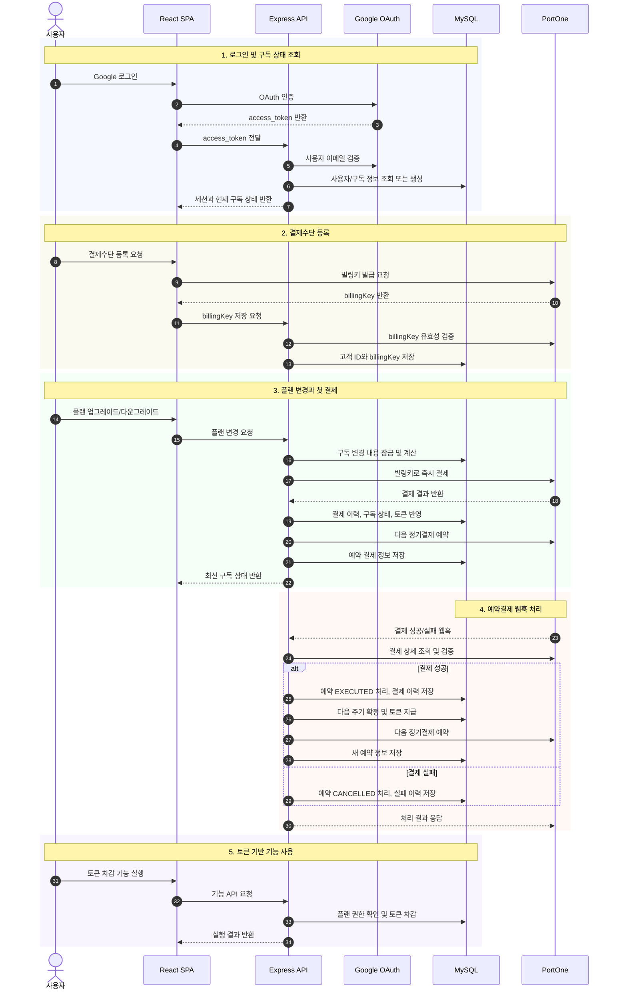
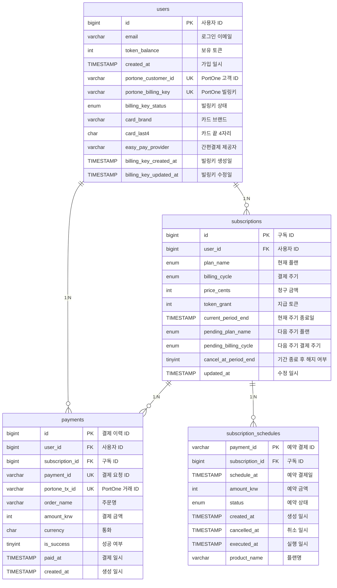

# 구독 결제 및 토큰 관리 시스템

사용자의 구독 플랜에 따라 정기결제와 토큰 지급/차감을 관리하는 풀스택 프로젝트입니다.  
이메일·Google OAuth 로그인, 플랜 변경, 결제수단 등록, 정기결제 예약, 웹훅 기반 결제 처리 흐름을 한 프로젝트에서 확인할 수 있습니다.

---

## 시퀀스 다이어그램

---

## ERD

---

## 기술 스택

- **프런트엔드**: React 18, TypeScript, webpack, react-router, react-bootstrap, react-toastify
- **백엔드**: Node.js(Express), TypeScript, mysql2, express-session, PortOne Server SDK, axios
- **데이터베이스**: MySQL 8+
- **기타**: dotenv, uuid, lodash/throttle

---

## 외부 API/라이브러리

- **PortOne Browser/Server SDK**: 빌링키 발급, 결제 검증, 정기결제 스케줄링
- **Google OAuth**: 소셜 로그인
- **MySQL Event Scheduler**: 구독 상태 검증 및 무료 플랜 전환 처리
