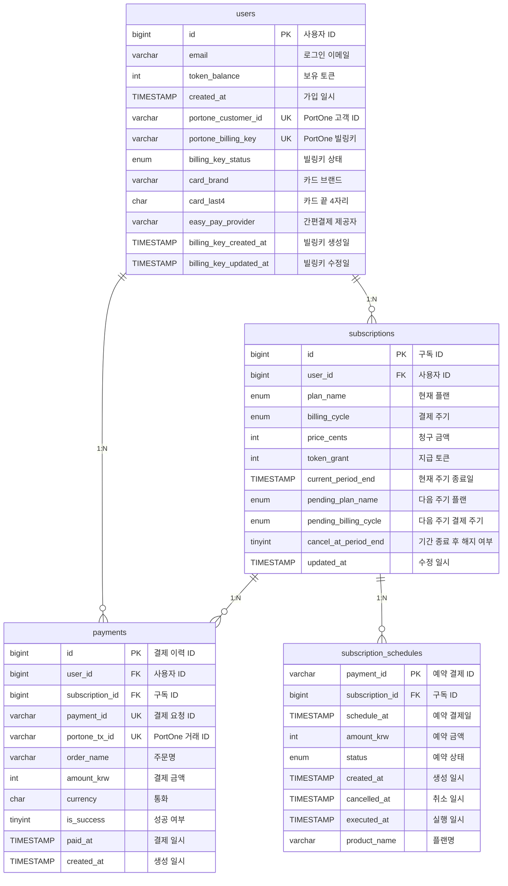

# 구독/결제 데모 프로젝트

간단한 구독 시나리오를 재현한 풀스택 데모입니다.  
이메일·Google OAuth 로그인, 플랜 변경, 토큰 차감, PortOne 빌링키/정기결제 흐름, 웹훅 처리를 한 프로젝트에서 확인할 수 있습니다.

---

## 기술 스택

- **프런트엔드**: React 18, TypeScript, webpack, react-router, react-bootstrap, react-toastify
- **백엔드**: Node.js(Express), TypeScript, mysql2, express-session, PortOne Server SDK, axios
- **데이터베이스**: MySQL 8+
- **기타**: dotenv, uuid, lodash/throttle

---

## 주요 기능

- 이메일/Google OAuth 기반 로그인 및 세션 관리
- 구독 플랜 업그레이드·다운그레이드, 다음 결제일 변경
- PortOne Billing Key 발급/삭제, 정기 결제 스케줄 생성·취소
- 결제 성공/실패 웹훅 처리 및 토큰 지급
- 플랜별 토큰 차감 기능 호출 UI (react-window 기반 리스트)

---

## 프로젝트 구조

```
subscription/
├── back-end/          # Express + TypeScript API 서버
│   ├── src/
│   │   ├── router/    # login, subscription, payment, webhook 라우터
│   │   ├── middleware/
│   │   ├── all_Types.ts, all_Store.ts
│   │   └── web.ts     # 서버 엔트리포인트
│   ├── dist/          # webpack 번들 산출물
│   └── package.json
├── front-end/         # React SPA
│   ├── src/
│   │   ├── component/Login
│   │   ├── component/Subscription
│   │   └── class/     # 상태/서비스 래퍼
│   └── package.json
├── dump.sql  # DB 스키마 및 샘플 데이터
└── README.md
```

---

## ERD / 아키텍처

### 데이터 모델



### 흐름도

```
[React SPA] --axios--> [Express API] --MySQL--
     |                         |
     | PortOne Browser SDK     | PortOne Server SDK (결제 검증/스케줄)
     └------ PortOne ---------┘

Webhooks:
PortOne → /pw/portone → (verify) → DB 업데이트 → 토큰 지급/스케줄링

DB Event Scheduler:
ev_apply_pending_free 이벤트가 정기적으로 `subscriptions` 테이블에서
`cancel_at_period_end = 1` 또는 `pending_plan_name = 'FREE'` 대상자를 조회해
무료 플랜으로 일괄 전환합니다. PortOne 정책상 무료 전환 예약에 대한
웹훅이 제공되지 않아, DB 이벤트로 직접 처리합니다.
```

---


## 주요 기능
- 이메일/Google OAuth 로그인 및 세션 유지
- 구독 플랜 업그레이드,다운그레이드 및 다음 결제일 조정
- PortOne Billing Key 발급/삭제, 정기 결제 스케줄 생성,취소
- 결제 웹훅 처리 후 토큰 지급,차감 흐름

## 외부 API/라이브러리
- PortOne Browser/Server SDK: 빌링키 발급, 결제 검증,스케줄링
- Google OAuth: 소셜 로그인
- MySQL 8+: 구독/결제 데이터 저장 , 이벤트 스케쥴러로 구독 검증,스케줄링

