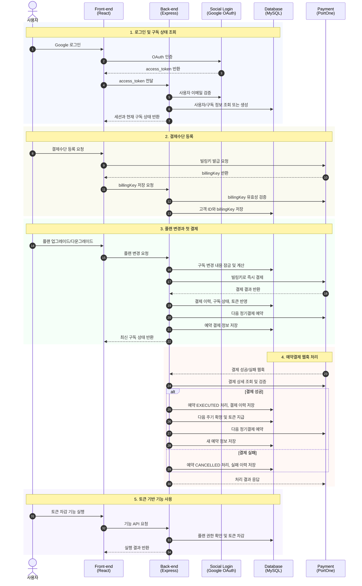
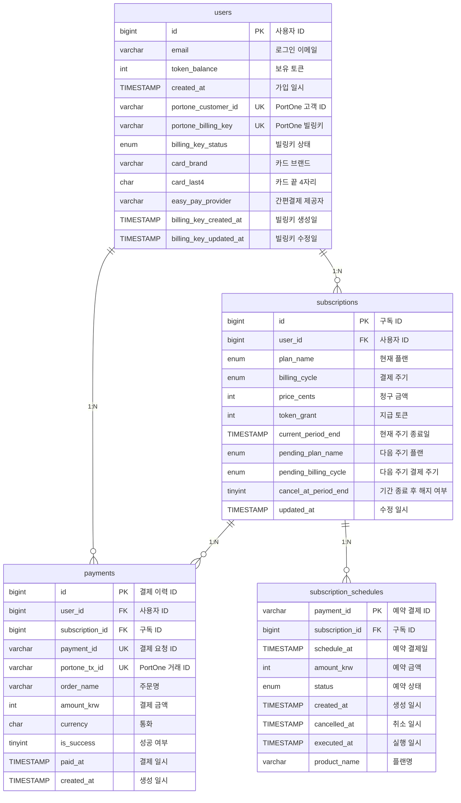

# 구독 결제 및 토큰 관리 시스템

사용자의 구독 플랜에 따라 정기결제와 토큰 지급/차감을 관리하는 프로젝트입니다.  
프론트엔드는 React와 TypeScript로 구현하고, 백엔드는 Express와 MySQL로 회원·구독·토큰 상태를 관리했습니다. 로그인은 Google OAuth, 결제수단 등록과 정기결제는 PortOne 결제 API를 연동해 처리했습니다.

---

## 시퀀스 다이어그램

---

## 시연 영상

## 시연 사이트

http://221.154.120.167:3002/

---

## ERD

---

## 기술 스택

**프런트엔드**

**백엔드**

**데이터베이스**

**기타**

---

## 외부 연동 및 주요 인프라 기능

- **PortOne Payment Gateway**: 빌링키 발급, 결제 검증, 정기결제 스케줄링
- **소셜 로그인 (Google OAuth)**: Google 계정 기반 로그인
- **MySQL Event Scheduler**: 구독 상태 검증 및 무료 플랜 전환 처리

